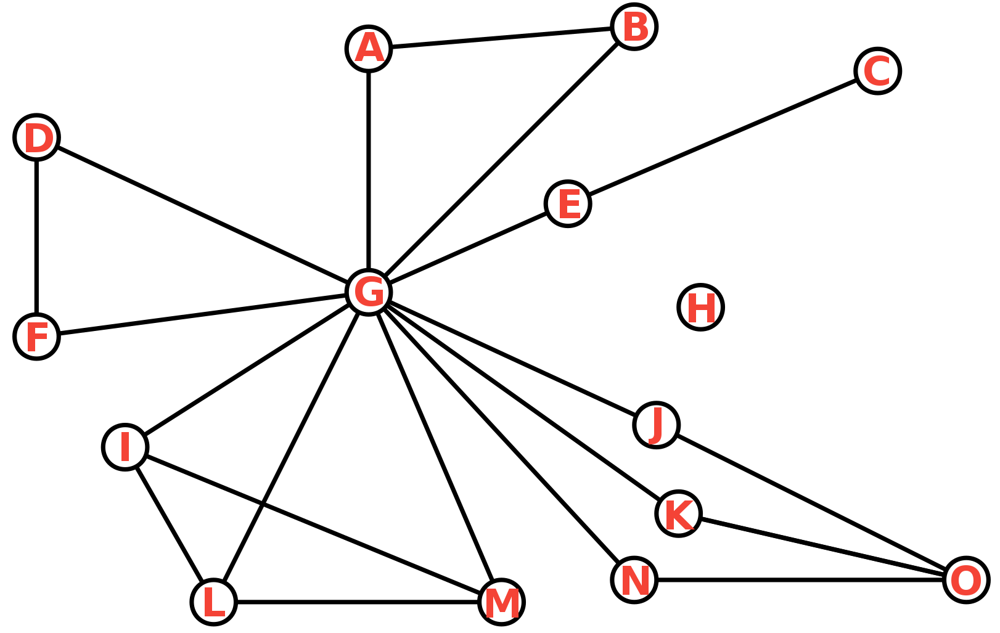

# The Ultimate Omniscient Network/Graph Metrics Cheat Sheet of Full Completeness and Correctness

Node H will be ignored if the metric requires a connected graph.

## Graph Metrics

| Name       | Symbol         | Formal Description        | Verbal Description               | Definition              |
| ---------- | -------------- | ------------------------- | -------------------------------- | ----------------------- |

## Node Metrics

* Nodes $u$ and $v$
* Set of nodes $V$
* Number of nodes $n$

| Name  | Symbol | Definition | Formal Description | Verbal Description | Example |
| ----- | ------ | ---------- | ------------------ | ------------------ | ------- |
| Distance | $d(u,v)$ |
| Degree |
| Betweenness
| Closeness
| Closeness Centrality | $C(u)$ |$\frac{1}{n}\sum_{v \in V}d(u,v)$ |  | Avg. distance to all nodes | $C(G) = \frac{14}{15}$ |
| Eccentricity
